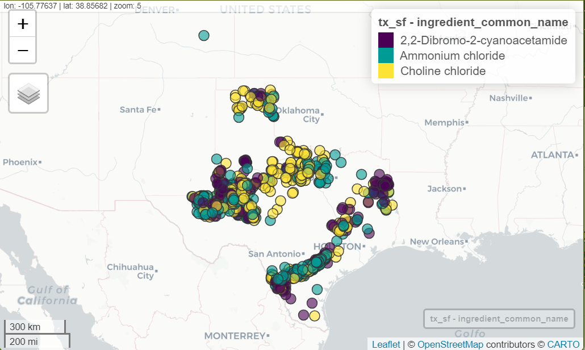

# Curation of FracFocus database for EDA and time-series analysis

## Repo is currently being worked on for the July 18th event!

Requires R \> 4.4.1 and the packages listed in the `curation.R` script. There are some listed later on if we get to mapping with the larger datasets.

RStudio is heavily recommended with versions \>= 2024.04.2+764 "Chocolate Cosmos" as of July 16th 2024.

Lines 1-37 will help install packages + local functions needed. If you have trouble installing the required packages, I will try to be there 15 min early to help troubleshoot. You can also install the packages manually using `install.packages(...)` and then calling `library(...)`.

Suggested to have packages installed, the files downloaded and read into the environment, or cached into 'feather' files. The frac_raw object should be around \~2.4 GB in size (6.5 M rows).

## Tenative list of talking points:

-   Introductions

```{=html}
<!-- -->
```
-   Why this dataset

-   Reading in lots of data

-   Cleaning and coercing

-   Diagnostic plots + summary analyses

-   TS plotting + spatial plotting

-   Extra time: appropriate colors, mapping package choices


